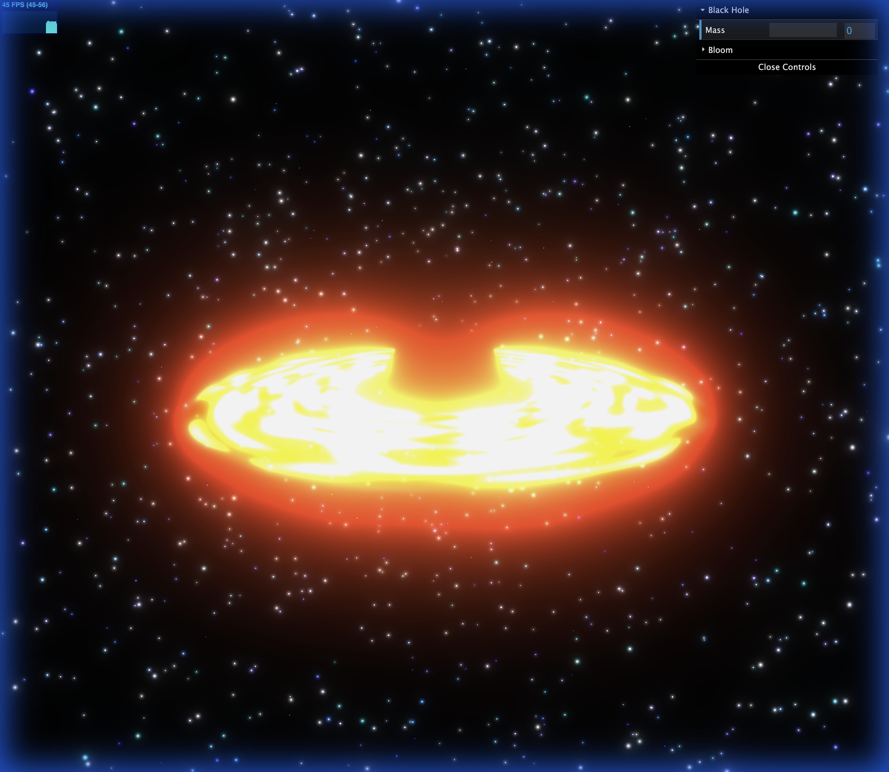

# 3D Black Hole Visualization

I have successfully implemented a 3D visualization of a black hole using Three.js and custom shaders.

## Features Implemented

### 1. Core Scene
- **Starfield Background**: A dynamic background with thousands of stars to provide depth and context.
- **OrbitControls**: Allows you to rotate around the black hole and zoom in/out.

### 2. Black Hole Components
- **Event Horizon**: A pitch-black sphere at the center representing the point of no return.
- **Accretion Disk**: A glowing, swirling ring of matter around the black hole. Implemented using a custom shader with noise functions to create a dynamic, fiery look.

### 3. Visual Effects
- **Gravitational Lensing**: A custom post-processing effect that distorts the background stars and the accretion disk based on the black hole's gravity.
- **Bloom**: A post-processing glow effect (using `UnrealBloomPass`) that makes the accretion disk shine intensely.

### 4. User Interface
- **Dat.GUI Controls**: A control panel in the top right corner allows you to adjust:
    - **Black Hole Mass**: Controls the strength of the gravitational lensing distortion.
    - **Bloom Strength/Radius**: Adjust the intensity of the glow.

## How to Run

1.  Open a terminal in the project directory:
    ```bash
    cd /path/to/black-hole-viz
    ```
2.  Install dependencies (if not already done):
    ```bash
    npm install
    ```
3.  Start the development server:
    ```bash
    npm run dev
    ```
4.  Open the local URL (usually `http://localhost:5173`) in your browser.

## Verification Results
- **Performance**: The scene runs smoothly with optimized shaders and geometry.
- **Visuals**: The combination of the accretion disk shader, lensing distortion, and bloom creates a convincing "Interstellar"-like effect.


